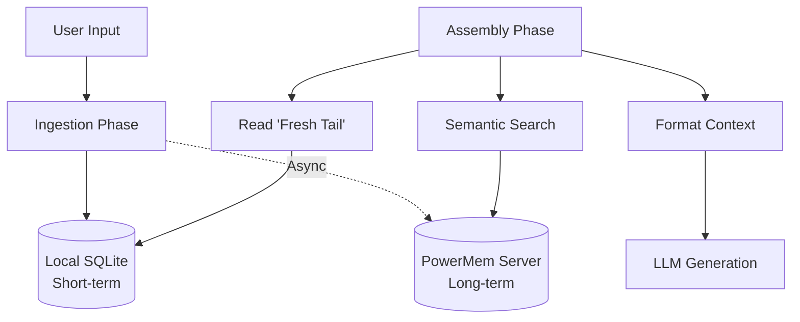

# OpenClaw PowerMem Plugin

A high-performance, intelligent memory plugin for OpenClaw, powered by [OceanBase PowerMem](https://github.com/oceanbase/powermem). 

This plugin replaces OpenClaw's default context engine with a **hybrid memory architecture**, combining the immediate responsiveness of a local sliding window with the infinite, intelligent recall capabilities of PowerMem.

## 🌟 Key Features

- **🧠 Intelligent Long-term Memory**: Leverages PowerMem's semantic search, automatic fact extraction, and Ebbinghaus forgetting curve.
- **⚡ Zero-Latency Short-term Context**: Maintains a "fresh tail" of recent messages locally (via SQLite) to ensure conversation continuity without network overhead.
- **🏢 Multi-Tenant & Multi-Agent Isolation**: Built-in support for running multiple OpenClaw instances and multiple agents, keeping their memories strictly isolated.
- **🧩 Structured Context Assembly**: Intelligently formats retrieved memories into XML-like structures within the System Prompt, maximizing the LLM's comprehension and instruction-following abilities.

---

## 🛠️ Architecture



---

## 🚀 Getting Started

### 1. Prerequisites

You must have a running instance of the **PowerMem HTTP API Server**.

```bash
# Start PowerMem via Docker
docker run -d \
  --name powermem-server \
  -p 8000:8000 \
  --env-file .env \
  oceanbase/powermem-server:latest
```
*(For detailed PowerMem setup, see the [PowerMem Documentation](https://www.powermem.ai/docs/api/api_server/)).*

### 2. Installation

Clone this repository into your OpenClaw plugins directory and build it:

```bash
cd /path/to/openclaw/plugins
git clone https://github.com/your-repo/openclaw-plugin-powermem.git
cd openclaw-plugin-powermem
npm install
npm run build
```

### 3. Configuration

Enable and configure the plugin in your `openclaw.json` file.

```json
{
  "plugins": {
    "entries": {
      "powermem-claw": {
        "enabled": true,
        "config": {
          "powerMemUrl": "http://localhost:8000",
          "instanceId": "prod_server_1",
          "agentId": "support_bot_01",
          "freshTailCount": 32
        }
      }
    },
    "slots": {
      "contextEngine": "powermem-claw"
    }
  }
}
```

#### Configuration Options

| Option | Type | Default | Description |
|--------|------|---------|-------------|
| `powerMemUrl` | string | `http://localhost:8000` | The URL of your PowerMem API server. |
| `instanceId` | string | `""` | Identifier for the OpenClaw instance. Used for multi-tenant isolation. |
| `agentId` | string | `"default_agent"` | Identifier for the specific agent. Used for memory isolation. |
| `freshTailCount`| number | `32` | Number of recent messages to keep in the local SQLite database for immediate context. |

---

## 🔒 Multi-Instance & Multi-Agent Isolation

This plugin is designed for enterprise deployments. It automatically isolates memory contexts based on the provided configuration:

- **Local Storage Isolation**: Creates separate SQLite database files for each agent (e.g., `context_prod_server_1_support_bot_01.db`) inside OpenClaw's data directory.
- **PowerMem Storage Isolation**: Uses a composite key (`{instanceId}_{agentId}`) as the `user_id` when communicating with PowerMem, ensuring one agent cannot access another's memories.

---

## 🧠 How Context Assembly Works

When OpenClaw asks the plugin to assemble context for the LLM, the following happens:

1. **Retrieve Fresh Tail**: It fetches the last `freshTailCount` (default: 32) messages from the local SQLite database. This guarantees the LLM remembers the immediate back-and-forth conversation.
2. **Semantic Search**: It takes the user's latest message and queries PowerMem for relevant historical memories.
3. **XML Injection**: The retrieved historical memories are injected into the System Prompt using structured `<relevant_memories>` tags.
4. **Structured Parsing**: The plugin ensures that complex message structures (like tool calls and results) are properly preserved and sent to the LLM.

---

## 📄 License

MIT License
